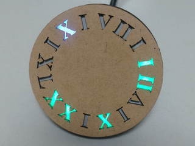
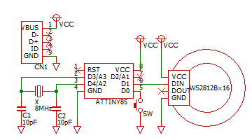
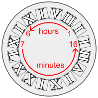
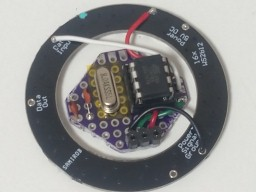
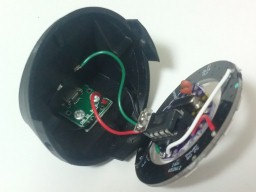
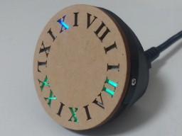

# ATtiny85RomanClock

A clock using the Roman numeral system with 16 RGB LEDs.

## Instruction

The hours are displayed in 12-hour format and are orange for a.m. / blue for p.m.

By pressing the button briefly, the brightness changes between 3 levels.

It enters adjustment mode by holding the button for over 2 seconds.

* Short button press: Increases the number.
* Long button press: Toggles between hours and minutes.

It returns to normal mode by holding the button for over 2 seconds again.

## Hardware

### Components

* An [ATtiny85](https://akizukidenshi.com/catalog/g/g109573/)
* [Ring-arranged 16 WS2812Bs](https://eleshop.jp/shop/g/gJ1H311/)
* A [8 MHz crystal oscillator](https://akizukidenshi.com/catalog/g/g108667/)
* Two [10pF ceramic capacitors](https://akizukidenshi.com/catalog/g/g105106/)
* A [USB connector](https://akizukidenshi.com/catalog/g/g117123/) for supplying power
* A tactile switch
* Wires, connectors, etc...

### Schematic

For accurate timekeeping, the CPU clock is driven by an external crystal oscillator circuit.

The current time is indicated by 16 LEDs arranged in a ring.
The mapping of Roman numerals is shown as follows.
The first 6 are assigned to hours and the remaining 10 are assigned to minutes.

### Examples

## Software

### Build environment

[Install ATTinyCore boards to the Arduino IDE](https://github.com/SpenceKonde/ATTinyCore/blob/master/Installation.md) and configure the settings as follows.

Attribute        |Value
-----------------|------------------------------
Board            |ATtiny25/45/85 (No bootloader)
Chip             |ATtiny85
Clock            |8 MHz (External)
B.O.D. Level     |B.O.D. Disabled (saves power)
Save EEPROM      |EEPROM not retained
Timer 1 Clock    |CPU (CPU frequency)
LTO              |Enabled
millis()/micros()|Enabled

This sketch depends on following library. (You can add this by library manager)

* [Adafruit NeoPixel](https://github.com/adafruit/Adafruit_NeoPixel)

Be careful. The external oscillator circuit is required for programming both the bootloader and the sketches.

Usually the interval between each `loop()` function call is 125 ms (= one eighth of a second), but it's 126 ms once every 85 loops in my case.
This may be affected by the circuit conditions.
Therefore, you should adjust the constant `ADJUSTER_MAX`.

### License

These codes are licensed under [MIT License](LICENSE).

## References

* [17 O Clock | Hackaday.io](https://hackaday.io/project/202278-17-o-clock)
